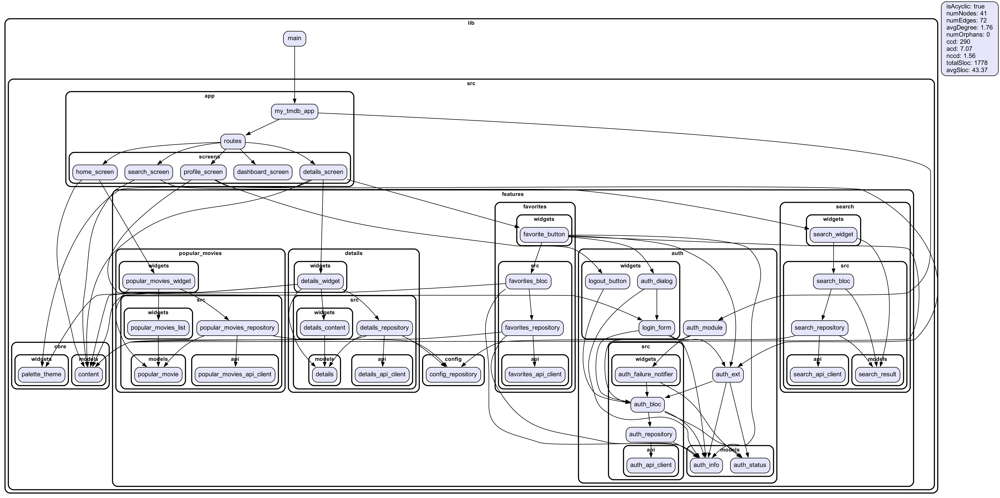

# MyTMDB

This is a "crowdsourced" Flutter tutorial project, mainly showcasing an architecture for a full-fledged app, but can be used to demonstrate other Flutter-specific approaches.

The main architecture principle for this app is KISS: removing abstractions that only exist "because this is best practice".

Being a code reviewer, consultant and mentor on a regular basis, I often see these overengineering practices come into Flutter apps architectures – so this sample project is my attempt to vote against this cargo cult of "enterprise-style" architecture, and show that even the simple architecture can be scalable.

The app itself is the client to [TMDB API][1]: some abstract "movie" app. There are no exact specifications and we can add as many features as we want.

Why "crowdsourced"? You're free to participate in this project in any form: ask questions if something is unclear; argue if the architecture is too simple or too complex (but be ready to prove your point of view); request some features to implement to see how (or if) it can be implemented using this KISS approach. And, of course, create PRs and participate in discussions.

## Modular architecture

## Attribution

This product uses the TMDB API but is not endorsed or certified by TMDB.

[1]: https://developers.themoviedb.org/3/getting-started/introduction
